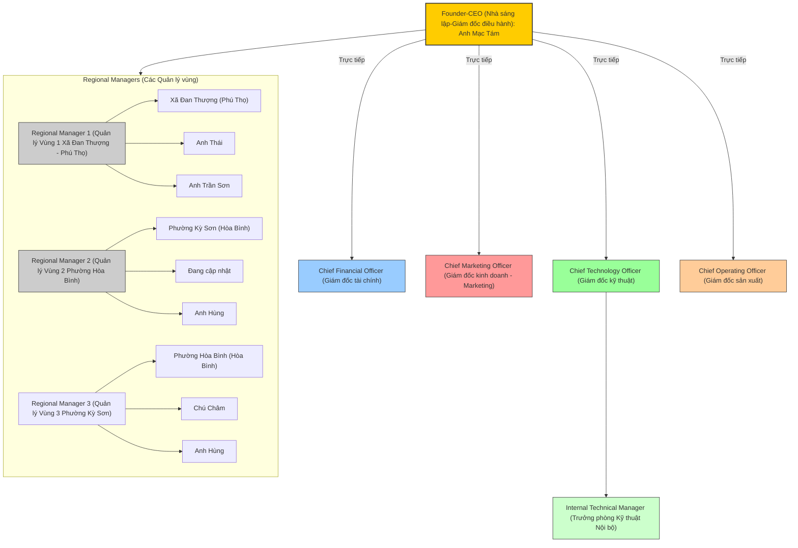

# Sơ đồ tổ chức Tre Thanh Phát (Organizational Chart)

```mermaid
flowchart TD
CEO["Founder-CEO (Nhà sáng lập-Giám đốc điều hành): Anh Mạc Tám"]
    CEO --> |"Trực tiếp"| CFO["Chief Financial Officer (Giám đốc tài chính)"]
    CEO --> |"Trực tiếp"| CMO["Chief Marketing Officer (Giám đốc kinh doanh - Marketing)"]
    CEO --> |"Trực tiếp"| CTO["Chief Technology Officer (Giám đốc kỹ thuật)"]
    CEO --> |"Trực tiếp"| COO["Chief Operating Officer (Giám đốc sản xuất)"]
    %% Gom nhóm quản lý vùng
    subgraph REG["Regional Managers (Các Quản lý vùng)"]
        direction LR
        RM1["Regional Manager 1 (Quản lý Vùng 1 Xã Đan Thượng - Phú Thọ)"]
        RM1 --> RM1-NAME["Xã Đan Thượng (Phú Thọ)"]
        RM1 --> RM1-OWNER["Anh Thái"]
        RM1 --> RM1-MAN["Anh Trần Sơn"]

        RM2["Regional Manager 2 (Quản lý Vùng 2 Phường Hòa Bình)"]
        RM2 --> RM2-NAME["Phường Kỳ Sơn (Hòa Bình)"]
        RM2 --> RM2-MAN["Đang cập nhật"]
        RM2 --> RM2-OWNER["Anh Hùng"]

        RM3["Regional Manager 3 (Quản lý Vùng 3 Phường Kỳ Sơn)"]
        RM3 --> RM3-NAME["Phường Hòa Bình (Hòa Bình)"]
        RM3 --> RM3-MAN["Chú Châm"]
        RM3 --> RM3-OWNER["Anh Hùng"]

    end
    CEO --> REG

    CTO --> ITM["Internal Technical Manager (Trưởng phòng Kỹ thuật Nội bộ)"]

%% 🎨 Màu sắc
    style CEO fill:#ffcc00,stroke:#333,stroke-width:2px
    style CFO fill:#99ccff,stroke:#333,stroke-width:1px
    style CMO fill:#ff9999,stroke:#333,stroke-width:1px
    style CTO fill:#99ff99,stroke:#333,stroke-width:1px
    style COO fill:#ffcc99,stroke:#333,stroke-width:1px
    style RM1 fill:#cccccc,stroke:#333,stroke-width:1px
    style RM2 fill:#cccccc,stroke:#333,stroke-width:1px
    style ITM fill:#ccffcc,stroke:#333,stroke-width:1px


```
